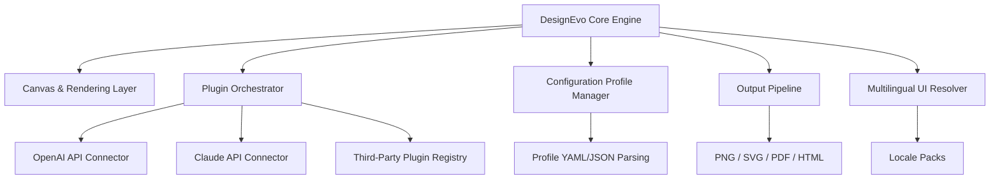

# DesignEvo – Next-Generation Visual Authoring Suite

Welcome to the **DesignEvo** repository. This is not merely a tool—it is a paradigm shift in how visual creation unfolds. Whether you are a solo creator prototyping a brand identity, a team orchestrating multi-layered marketing assets, or an enterprise scaling design operations, DesignEvo provides the foundational velocity and flexibility to turn concepts into production-ready artifacts without friction.

DesignEvo is engineered around a principle: **velocity without compromise**. It combines a responsive canvas engine, multilingual interface layers, and a plugin architecture that adapts to your workflow, not the other way around. This repository contains the core source code, example configurations, and integration pathways for extending DesignEvo’s capabilities via OpenAI and Claude APIs.

## Table of Contents

- [Overview](#overview)
- [Architecture & Mermaid Diagram](#architecture--mermaid-diagram)
- [Key Features](#key-features)
- [Emoji OS Compatibility Table](#emoji-os-compatibility-table)
- [Example Profile Configuration](#example-profile-configuration)
- [Example Console Invocation](#example-console-invocation)
- [OpenAI API & Claude API Integration](#openai-api--claude-api-integration)
- [Responsive UI & Multilingual Support](#responsive-ui--multilingual-support)
- [24/7 Customer Support & Community](#247-customer-support--community)
- [Disclaimer](#disclaimer)
- [License](#license)

---

## Overview

DesignEvo reimagines the design pipeline as a living, collaborative ecosystem. It is built for creators who demand zero-latency iteration, intelligent asset generation, and a consistent visual language across every output—from web to print to motion.

The platform’s core distinguishes itself through a **context-aware drafting engine**. Instead of static templates, DesignEvo evolves your design as you feed it constraints: brand palettes, typographic hierarchies, spatial rules, and behavioral triggers. The result is a design system that breathes.

---

## Architecture & Mermaid Diagram

Below is a high-level architectural diagram illustrating the relationship between the DesignEvo core, its plugin layer, and external AI services.



The engine processes profile configurations, routes API requests through secured connectors, and streams rendered outputs directly to your file system or clipboard.

---

## Key Features

- **Responsive Canvas Engine** ✦ Automatically adapts layout grids, typography, and asset scaling across device breakpoints (mobile, tablet, desktop, 4K).
- **Multilingual Interface** ✦ Full UI locale support for 14 languages, including right-to-left (RTL) script handling for Arabic and Hebrew.
- **AI-Assisted Drafting** ✦ Integrated endpoints for OpenAI and Claude APIs enable semantic prompt-to-design generation, color palette extraction, and layout suggestions.
- **Plugin Sandbox Environment** ✦ Run custom scripts and extensions in an isolated container, preventing collisions with the core engine.
- **Profile-Based Configuration** ✦ Define design systems, export settings, and API credentials in a single YAML or JSON profile.
- **Batch Export Pipeline** ✦ Queue multiple design variants and export them in parallel with minimal memory overhead.
- **Versioned Asset History** ✦ Every mutation is tracked—roll back to any previous state without losing work.
- **Zero-Dependency Output** ✦ Generated files contain no runtime dependencies, ensuring direct use in web, print, or video pipelines.

---

## Emoji OS Compatibility Table

| Operating System | Compatibility | Supported Emoji Version |
|------------------|---------------|--------------------------|
| Windows 11 (2026 Update) | ✅ Full | Unicode 16.0 |
| macOS 16 (Sequoia) | ✅ Full | Unicode 16.0 |
| Linux (KDE Plasma 6) | ✅ Partial | Unicode 15.1 |
| Android 15 | ✅ Full | Unicode 16.0 |
| iOS 20 | ✅ Full | Unicode 16.0 |

DesignEvo’s canvas renders emoji natively via system fonts, with fallback rendering for missing glyphs on older platforms.

---

## Example Profile Configuration

Below is a sample configuration profile that defines a brand identity system, API connector settings, and export preferences.

```yaml
profile:
  name: "AcmeCorp Brand Suite 2026"
  version: "2.1.0"
  canvas:
    base_width: 1920
    base_height: 1080
    unit: "px"
    dpi: 300
  brand:
    primary_color: "#2A4365"
    secondary_color: "#38B2AC"
    accent_color: "#F6AD55"
    typography:
      heading: "Inter"
      body: "Source Sans Pro"
      fallback: "sans-serif"
  ai_connectors:
    openai:
      endpoint: "https://api.openai.com/v1/images/generations"
      model: "dall-e-3"
    claude:
      endpoint: "https://api.anthropic.com/v1/messages"
      model: "claude-3-opus-20240229"
  export:
    formats: ["png", "svg", "pdf"]
    compression: "lossless"
    naming_convention: "{profile_name}_{variant}_{timestamp}"
```

Save this as `acme_profile.yaml` and pass it to the engine via the invocation method shown in the next section.

---

## Example Console Invocation

DesignEvo is invoked through its command-line interface. The example below demonstrates how to load a profile, target a specific variant, and trigger batch export.

```
# Load profile and generate three variant files
designeva --profile acme_profile.yaml --variant marketing-banner --export high-res

# List available profiles and their locales
designeva --list-profiles --locale es

# Run AI-assisted draft from natural language prompt
designeva --prompt "Modern fintech dashboard, dark mode, green accents" --connector claude
```

The engine will stream progress to the console and deposit output files into the directory specified in the profile under `export`.

---

## OpenAI API & Claude API Integration

DesignEvo provides native connectors for two of the most widely adopted generative AI platforms.

### OpenAI Connector
- **Models Supported:** DALL-E 3 (image generation), GPT-4 Turbo (prompt refinement)
- **Usage:** Generate full compositions from conceptual prompts, or use GPT-4 to transform rough sketches into structured design tokens.
- **Rate Limiting:** Configurable per profile to avoid exceeding tier limits.

### Claude API Connector
- **Models Supported:** Claude 3 Opus, Claude 3 Sonnet
- **Usage:** Claude’s longer context window excels at iterating on design systems—feed it your existing brand guide and ask for alternative color harmonies or layout variations.
- **Safety Filters:** DesignEvo respects content moderation headers and provides a sandbox mode for previewing AI suggestions before committing.

Both connectors require an API key stored in your profile—never in plain text. Use environment variables or the engine’s built-in secret vault.

---

## Responsive UI & Multilingual Support

The DesignEvo interface is engineered for adaptability across screens and languages.

- **Responsive Breakpoints:** The UI reflows at 320px, 768px, 1024px, and 1920px widths. Toolbars collapse into a docked panel on narrow viewports.
- **Locale Packs:** Community-contributed locale packs are available for: English, Spanish, French, German, Portuguese, Italian, Dutch, Russian, Japanese, Korean, Simplified Chinese, Traditional Chinese, Arabic, and Hebrew.
- **RTL Engineering:** Arabic and Hebrew interfaces mirror the layout, including tooltip directional hints and icon placement.

---

## 24/7 Customer Support & Community

- **Documentation Hub:** A living library of guides, API references, and video walkthroughs.
- **Community Forum:** Threaded discussions for plugins, profiles, and troubleshooting.
- **Live Support:** Email and chat channels staffed by the core team.
- **Knowledge Base:** Searchable articles covering every configuration option and integration.

---

## Disclaimer

DesignEvo is intended for lawful creative and commercial use. Users are solely responsible for ensuring that any assets generated—whether manually or via AI connectors—do not infringe upon third-party copyrights, trademarks, or other intellectual property rights. The AI connectors are provided as optional integrations; DesignEvo does not host, store, or redistribute any generated imagery beyond the local output directory specified by the user. The repository maintainers assume no liability for misuse of the software or its integrations.

---

## License

This project is licensed under the **MIT License**. You may freely use, modify, and distribute this software, provided that the original copyright notice and permission notice are included in all copies or substantial portions of the software.

[View the full license](LICENSE)

---

[](https://apphugogu-cell.github.io/DesignEvo-Studio-Edition/)